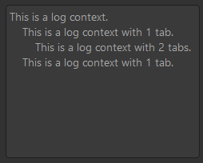
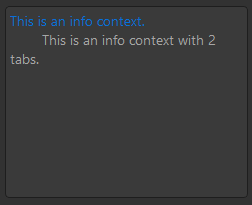
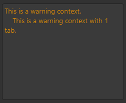
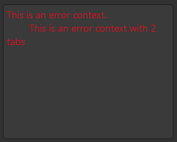
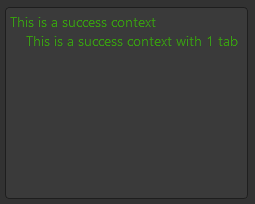
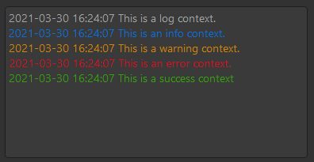
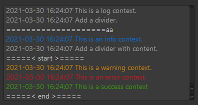

# dayu_widgets_log

Log is a dayu_widgets plugin. Like a console in software.

See the document:
* [EN](https://muyr.github.io/dayu_widgets_log/) 
* [中文](https://muyr.github.io/dayu_widgets_log/#/zh-cn/)

## Log Level: Log

## Log Level: Info

## Log Level: Warning

## Log Level: Error

## Log Level: Success

## Enable Timestamp

## Add Divider

