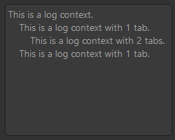
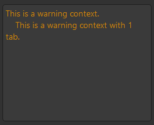
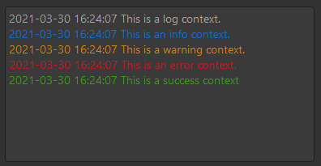
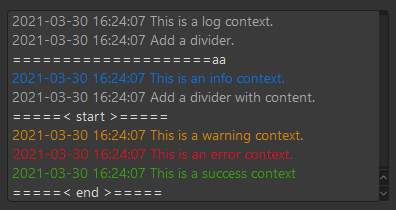

# Log for Dayu Widgets
打印进度或者 Log 信息。类似软件中的 Console 窗口 

## 何时使用
* 操作步骤较多，需要显示用户每次操作对应的结果、错误提示等等


## 安装
```pip install dayu-widgets-log```

## 导入模块
```python
from dayu_widgets_log import MLogTextEdit
```

## 代码演示


### Log Level: Log


```python
log_text_edit = MLogTextEdit()
log_text_edit.log('This is a log context.')
log_text_edit.log('This is a log context with 1 tab.', 1)
log_text_edit.log('This is a log context with 2 tabs.', 2)
log_text_edit.log('This is a log context with 1 tab.', 1)
```
[查看完整代码](https://github.com/muyr/dayu_widgets_log/tree/master/examples/log_text_edit_example.py)

### Log Level: Info

```python
info_log_text_edit = MLogTextEdit()
info_log_text_edit.info('This is an info context.')
info_log_text_edit.log('This is an info context with 2 tabs.', 2)
```
[查看完整代码](https://github.com/muyr/dayu_widgets_log/tree/master/examples/log_text_edit_example.py)

### Log Level: Warning

```python
warning_log_text_edit = MLogTextEdit()
warning_log_text_edit.warning('This is a warning context.')
warning_log_text_edit.warning('This is a warning context with 1 tab.', 1)

```
[查看完整代码](https://github.com/muyr/dayu_widgets_log/tree/master/examples/log_text_edit_example.py)


### Log Level: Error

```python
error_log_text_edit = MLogTextEdit()
error_log_text_edit.error('This is an error context.')
error_log_text_edit.error('This is an error context with 2 tabs', 2)
```
[查看完整代码](https://github.com/muyr/dayu_widgets_log/tree/master/examples/log_text_edit_example.py)


### Log Level: Success

```python
success_log_text_edit = MLogTextEdit()
success_log_text_edit.success('This is a success context')
success_log_text_edit.success('This is a success context with 1 tab', 1)
```
[查看完整代码](https://github.com/muyr/dayu_widgets_log/tree/master/examples/log_text_edit_example.py)


### Enable Timestamp

```python
enable_timestamp_text_edit = MLogTextEdit()
enable_timestamp_text_edit.enable_timestamp()
enable_timestamp_text_edit.log('This is a log context.')
enable_timestamp_text_edit.info('This is an info context.')
enable_timestamp_text_edit.warning('This is a warning context.')
enable_timestamp_text_edit.error('This is an error context.')
enable_timestamp_text_edit.success('This is a success context')
```
[查看完整代码](https://github.com/muyr/dayu_widgets_log/tree/master/examples/log_text_edit_example.py)


### Add Divider


```python
divider_text_edit = MLogTextEdit()
divider_text_edit.enable_timestamp()
divider_text_edit.log('This is a log context.')
divider_text_edit.log('Add a divider.')
divider_text_edit.divider()
divider_text_edit.info('This is an info context.')
divider_text_edit.log('Add a divider with content.')
divider_text_edit.divider('< start >')
divider_text_edit.warning('This is a warning context.')
divider_text_edit.error('This is an error context.')
divider_text_edit.success('This is a success context')
divider_text_edit.divider('< end >')
```
[查看完整代码](https://github.com/muyr/dayu_widgets_log/tree/master/examples/log_text_edit_example.py)

## API

### MLogTextEdit

继承自： `QTextEdit`

#### Properties

* 无

#### Public Functions

* `MLogTextEdit(parent=None)`
* `enable_timestamp()` 开启行首添加时间
* `log(str, tab=0)` 追加一行 log 级别的内容，可以额外传入一个数字，在行首添加指定个数的 tab
* `info(str, tab=0)` 追加一行 info 级别的内容，可以额外传入一个数字，在行首添加指定个数的 tab
* `error(str, tab=0)` 追加一行 error 级别的内容，可以额外传入一个数字，在行首添加指定个数的 tab
* `warning(str, tab=0)` 追加一行 warning 级别的内容，可以额外传入一个数字，在行首添加指定个数的 tab
* `success(str, tab=0)` 追加一行 success 级别的内容，可以额外传入一个数字，在行首添加指定个数的 tab
* `divider(str=None)`追加一行分割线，可以传入 content 内容，会显示在分隔符中间

#### Signals

* 无
